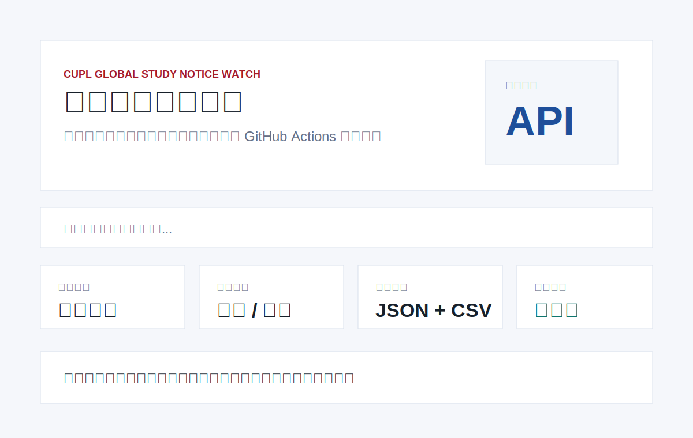

# CUPL Global Study Notice Watch

[中文说明](README.zh-CN.md)

Unofficial daily archive for public notices from China University of Political Science and Law's international cooperation / global study portal.



## What It Tracks

- Target site: `https://globalstudy.cupl.edu.cn/`
- Notice page: `https://globalstudy.cupl.edu.cn/news`
- Official API discovered from the site's public JavaScript bundle: `https://globalstudy.cupl.edu.cn/api/news/query`
- Sections: `notice` / `trend`, displayed as notices and news.

The current network may receive a site-protection HTML challenge instead of JSON. The scraper records diagnostics in `data/meta.json` and keeps existing archived notices intact.

## Quick Start

```bash
python3 scraper.py 3
python3 -m http.server 8000
```

Open `http://localhost:8000`.

## Data Files

- `data/notices.json`: merged historical notices.
- `data/notices.csv`: spreadsheet-friendly export.
- `data/history/YYYY-MM-DD.json`: notices seen during each run.
- `data/meta.json`: update time, source URLs, diagnostics and totals.

## GitHub Actions

`.github/workflows/update.yml` runs every day and commits changed files under `data/`.

## Why This Is Useful

International exchange notices are time-sensitive. A small public archive makes it easier for students, teachers and project teams to review historical opportunities, search titles quickly and export structured data.

## Roadmap

- Add multiple CUPL international-program sources.
- Add keyword alerts for exchange programs and funding.
- Publish a combined multi-office dashboard after more departments are archived.

## Disclaimer

This is an unofficial archive of public web information only. It does not bypass access controls, does not collect private data and does not represent China University of Political Science and Law.

## License

MIT
